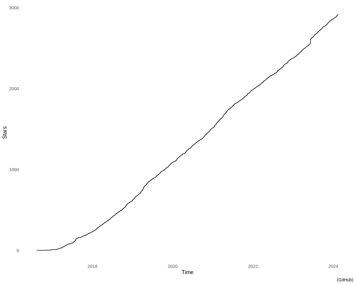

[](https://github.com/jesperolsson-se/stargazer-plot/actions/workflows/main.yml)
[](https://hub.docker.com/r/jesperolssonse/stargazer-plot)

**Stargazer plot** visualizes a project's GitHub stars as a time series,
providing insight into its popularity.



# Usage

First, obtain the stargazer data from the GitHub API.

```bash
organization="schemaspy"
repository="schemaspy"

echo "Timestamp" > data.csv
total_stars=$(curl -s "https://api.github.com/repos/${organization}/${repository}" | jq .stargazers_count)
pages=$((1 + $total_stars/100))
for i in $(seq 1 $pages); do
  curl -s "https://api.github.com/repos/${organization}/${repository}/stargazers\
?per_page=100&page=$i" \
-H 'Accept: application/vnd.github.v3.star+json' \
  | jq .[].starred_at >> data.csv
done
```

Then, pull and run the container.

```bash
docker pull jesperolssonse/stargazer-plot
docker run --rm \
-v "$(pwd)/data.csv":/data.csv \
-v "$(pwd)/output":/output \
stargazer-plot
```

That's it! You'll find the result in `output/stargazers.pdf`.
